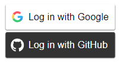
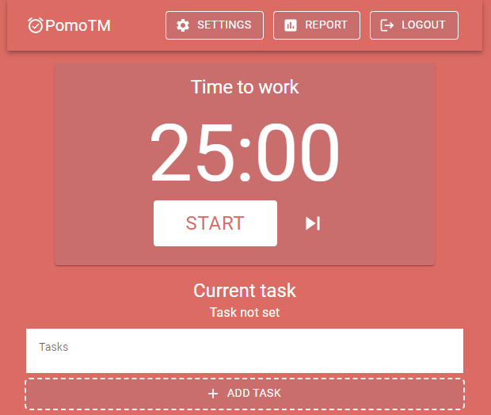
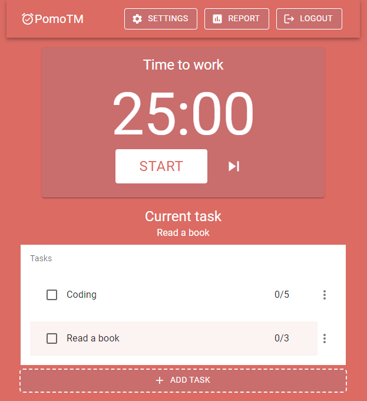

# Pomo time management

<p>
  <a href=""></a>
</p>

## Table of Contents

- [About](#about)
  - [Built with](#built-with)
  - [What is the Pomodoro Technique](#pomo-technique)
- [Getting started](#getting-started)
  - [Guide](#guide)
  - [Local installing](#local-installing)
  - [Setting up your firebase](#setting-up-firebase)
- [License](#license)

## About <a name="about"></a>

This app was inspired by [Pomodoro Technique](https://en.wikipedia.org/wiki/Pomodoro_Technique), which aims to improve your productivity and reduce procrastination time. The application consists of a pomodoro timer and a to-do list, both of which have settings and can keep history. There are two ways to authenticate([Github](https://github.com/) and [Google](https://mail.google.com/)).

### Built with <a name="built-with"></a>

[](https://skillicons.dev)

## Getting started <a name="getting-started"></a>

This app has already been deployed via github pages. You can try out the app [here](https://ivan-pl.github.io/pomo-time-management/). If you want test it locally, read [Local installing](#local-installing).

### Guide <a name="guide"></a>

1. Log in using one of the available methods:



2. You will see the following page:



3. Add tasks by pressing the ADD TASK button:

4. Select the current task by clicking on it so that the field below timer displays the name of the current task.



5. Press Start.

6. When you finish the task just click on the corresponding checkbox in the to-do list.

### Local installing <a name="local-installing"></a>

If you would like to run this app locally you should:

1. Clone repo

```
git clone https://github.com/ivan-pl/pomo-time-management.git
```

2. Install dependencies

```
npm install
```

3. Create .env in root directory. Read [Setting up firebase](#setting-up-firebase) to get variables for .env. Example:

```
REACT_APP_apiKey = "AIzaSaCs0gpaxxxxxxx-jDyVia7ixAxkjmVBY"
REACT_APP_authDomain = "pomo-time-management.firebaseapp.com"
REACT_APP_projectId = "pomo-time-management"
REACT_APP_storageBucket = "pomo-time-management.appspot.com"
REACT_APP_messagingSenderId = "2193xxxxxx088"
REACT_APP_appId = "x:21931xxxxx088:web:1d68xxxxx688e4d45"
REACT_APP_databaseUrl = "https://pomo-time-management-default-rtdb.europe-west1.firebasedatabase.app"
```

4. Run

```
npm start
```

### Setting up your firebase <a name="setting-up-firebase"></a>

In order to set up the app for your firebase instance you need:

1. Create your firebase project and instantiate an app to get web config. All instructions you will find [here](https://firebase.google.com).
2. Add Firebase Realtime Database and change rules to:

```
{
  "rules": {
    "users": {
      "$uid": {
        ".read": "$uid === auth.uid",
        ".write": "$uid === auth.uid"
      }
    }
  }
}
```

3. Add Authentication and allow auth via github and google:
4. Edit .env with your config
5. Run 🤗
